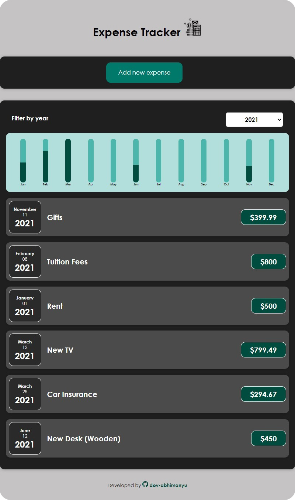
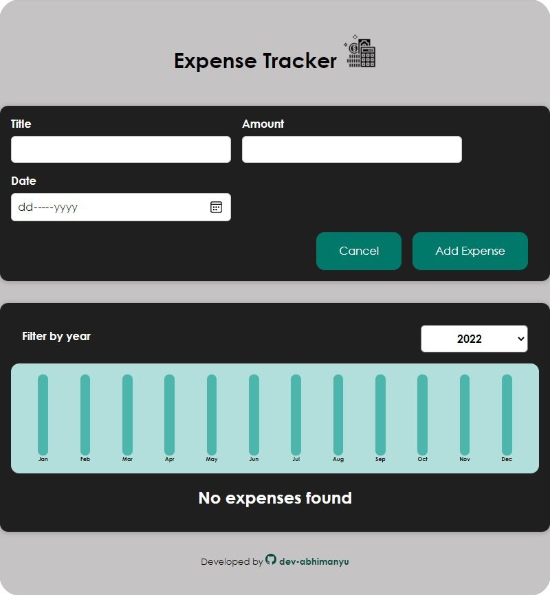

# Expense Tracker
**Check out the app at: http://dev-abhimanyu.github.io/expense-tracker**

An expense tracker application made with React.js. 

## Features
* Keep a track of expenses by simply adding a new expense to the list
* Get a visual representation of monthly expenses in the form of dynamic bar charts
* Filter the expenses by year

## Inside the code
The application makes use of key React concepts such as:
* Custom components
* Concept of "Composition" ("children props")
* "**useState**" React hook
* Two-way binding
* Child-to-Parent Component Communication
* Rendering Stateful Lists
* Dynamic styles

## Installation
* Install the required modules: `npm install`
* Start the application from main directory: `npm start`

**Check out the app at: http://dev-abhimanyu.github.io/expense-tracker**
